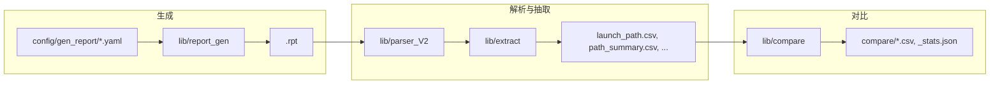

# Python 编码规范 (timerParse)

本规范适用于 timerParse 项目中的 Python 代码：保证代码分层清晰、报告解析流程可读可维护、注释完整、函数命名与长度统一。

## 何时应用

- 编写或审查本仓库中的 Python 代码
- 新增或修改报告解析器、报告生成器
- 重构现有模块或拆解长函数
- 需要统一命名、注释或分层时

## 代码分层与解析流程

### 边界划分

- **生成链路**：配置/模板 (YAML) → 生成器 (`lib/report_gen/`) → 报告文本 (.rpt)。生成器只负责根据配置输出文本，不读报告、不写 CSV。
- **解析链路**：报告文本 (.rpt) → 解析器 (`lib/parser_V2/`，含 TimeParser 与可选 YAML 布局）→ 结构化数据。解析器只做解析与归一化，不写文件。
- **抽取与对比**：`lib/extract.py`（及可选 `lib/parser_chaos/` 多进程）调用解析器、写 CSV；`lib/compare_path_summary.py` 与 `lib/compare/` 负责对比与报告。编排层保持 I/O，解析层无副作用。
- **入口**：CLI (`lib/cli.py`、`lib/__main__.py`) 和脚本（如 `scripts/run_validation_flow.py`）保持“薄”，只做参数解析与调用 lib，业务逻辑全部在 lib 内。

### 数据流示意

## 注释与文档

- **模块**：文件顶部 docstring 使用中文，简要说明本模块职责、在解析/生成流程中的位置，以及主要对外接口。
- **类**：类 docstring 使用中文，说明该类代表的实体或行为、与基类/子类的关系。
- **公开函数/方法**：必须有中文 docstring，包含功能说明、参数含义、返回值含义；若逻辑非显然，补充主要步骤或解析逻辑。
- **复杂逻辑**：正则、多分支、数值/单位换算等，在关键行上方或行尾用中文注释说明意图，避免“魔法数字”无说明。
- **解析逻辑**：在解析器与抽取相关代码中，对“如何从报告文本得到结构化字段”做明确注释（例如：按分隔符分块、按正则提取列、按 row_type 区分 launch_clock / data_path）。

## 命名规范

- **函数、方法**：**驼峰（camelCase）**，名称直接体现功能，如 `parseOnePath`、`splitLaunchByCommonPin`、`buildRenderPlan`。本项目约定函数使用驼峰，与 PEP 8 推荐的 snake_case 不同，以保持规范统一；新代码与重构时遵循驼峰。
- **类**：PascalCase，如 `TimeParser`、`TimingReportTemplate`。
- **变量、参数、模块级常量**：**snake_case**，与 PEP 8 一致，如 `launch_rows`、`path_ctx`、`SEMANTIC_POINT_ATTRS`。
- **私有/内部**：以单下划线开头，命名仍遵循上述规则（方法驼峰、变量 snake_case），如 `_normalizePin`、`_expandRows`。

## 函数设计

- **单一职责**：一个函数只做一件可从名称说清的事；若难以用一句话概括，考虑拆分为多个子函数。
- **长度**：单函数建议 **不超过约 100 行**（含空行与注释）。若超过，应拆成多个小函数，主函数只做流程编排，并用中文注释标出步骤（如：1. 解析表头；2. 按 path 分块；3. 逐块解析并累加）。
- **参数与返回值**：参数不宜过多（通常 ≤5～7 个）；若需更多，考虑用 dataclass 或 TypedDict 聚合。返回值类型在 docstring 或 type hint 中写明。

## 可读性与复用

- **步骤可见**：解析/生成流程用一系列小函数 + 清晰命名表达，避免单一大函数内嵌套过深。
- **职责单一文件**：单文件内避免堆积多种无关职责；格式差异（如 format1 / format2 / pt）放在子类或策略模块中，公共逻辑放在基类或 `lib/` 下的公共模块（如 `parser_V2/time_parser_base.py`、`report_gen/base.py`）。
- **复用**：可复用逻辑放在 `lib/` 公共模块或基类；各格式特有的正则、列名、表头格式在对应 parser/generator 子类中实现，通过继承或组合调用基类方法。

## 与现有代码的关系

- **新代码与重构**：必须遵循本规范（中文注释、驼峰函数名、单一职责、约 100 行内拆解）。
- **存量代码**：现有部分仍为 snake_case 函数名，可在后续迭代中逐步改为驼峰，不要求一次性全量替换；在修改某文件时，顺带将涉及函数改为驼峰并补全中文注释即可。
- **一致性**：同一模块内新增函数使用驼峰，避免同一文件中混用 snake_case 与 camelCase 函数名。

## 规范清单（自检用）

- [ ] 模块/类/公开函数均有中文 docstring，解析/生成逻辑有说明
- [ ] 函数/方法名为 camelCase，名称即功能说明
- [ ] 单函数约 ≤100 行，超出部分已拆解为子函数并保留清晰调用链
- [ ] 分层清晰：parser 仅解析不写文件；extract/compare 负责 I/O 与流程；CLI/脚本薄入口
- [ ] 变量/参数/常量为 snake_case
- [ ] 复杂逻辑与正则配有中文注释说明意图

## 更多说明与示例

- 命名对照（snake_case 旧名 → camelCase 新名）、长函数拆解示例等，见 [reference.md](reference.md)。
