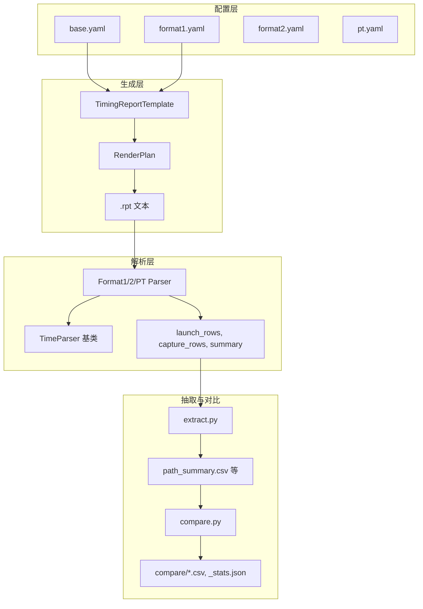

# Python 编码规范 — 参考与示例

本文档为 [SKILL.md](SKILL.md) 的补充，提供命名对照与长函数拆解示例。

## 命名对照（snake_case → camelCase）

以下为项目中常见函数/方法名的迁移对照，新代码与重构时采用右侧驼峰形式。

| 原 snake_case | 建议 camelCase | 说明 |
|---------------|----------------|------|
| `split_launch_by_common_pin` | `splitLaunchByCommonPin` | 按 common pin 拆分 launch 段 |
| `parse_one_path` | `parseOnePath` | 解析单条 path 文本 |
| `scan_path_blocks` | `scanPathBlocks` | 扫描报告中的 path 块 |
| `run_extract` | `runExtract` | 执行抽取子命令 |
| `run_compare` | `runCompare` | 执行对比子命令 |
| `build_render_plan` | `buildRenderPlan` | 构建渲染计划 |
| `_normalize_pin` | `_normalizePin` | 归一化 pin 字符串 |
| `_clean_metric_float` | `_cleanMetricFloat` | 清理浮点显示 |
| `_expand_rows` | `_expandRows` | 展开 row 模板（含 group/repeat） |
| `load_summary` | `loadSummary` | 加载 path_summary CSV |
| `compute_stats` | `computeStats` | 计算对比统计量 |
| `generate_html_report` | `generateHtmlReport` | 生成 HTML 对比报告 |

类名已为 PascalCase，无需改动（如 `TimeParser`、`ParseOutput`、`TimingReportTemplate`）。变量与参数保持 snake_case（如 `launch_rows`、`path_ctx`）。

## 长函数拆解示例

当单函数超过约 100 行时，按“主流程 + 子步骤”拆解：主函数只做步骤编排并加中文注释，具体逻辑下沉到命名清晰的子函数。

### 示例：报告解析入口

**拆解前（逻辑集中在一个大函数内）：**

- 一个函数内依次：读文件、按分隔符分块、逐块正则提取表头、逐块解析表格、合并 launch/capture、写 CSV，导致单函数 120+ 行。

**拆解后：**

1. **主函数**（约 20～30 行）：只做流程编排，用中文注释标出步骤。

```python
def runExtract(args) -> int:
    """执行 extract 子命令：解析 timing 报告并写出 CSV。"""
    # 1. 校验输入与解析格式
    rpt_path = resolveReportPath(args.input_rpt)
    format_key = resolveFormat(args.format, rpt_path)
    parser = createParser(format_key)

    # 2. 解析报告得到结构化数据
    output = parseReportWithJobs(parser, rpt_path, args.jobs)

    # 3. 写入 CSV 到输出目录
    ensureOutputDir(args.output_dir)
    writeExtractCsvs(output, args.output_dir)

    return 0
```

2. **子函数**：各负责一件事，命名即功能说明。

- `resolveReportPath(path_str)`：校验并返回绝对路径
- `resolveFormat(format_key, rpt_path)`：若为 auto 则检测，否则返回 format_key
- `parseReportWithJobs(parser, rpt_path, jobs)`：单/多进程解析，返回 `ParseOutput`
- `writeExtractCsvs(output, out_dir)`：将 `ParseOutput` 写入 launch_path.csv、capture_path.csv、path_summary.csv 等

这样主函数保持简短可读，修改某一步时只需改对应子函数；子函数各自约 10～40 行，便于单测与复用。

### 示例：HTML 报告生成

若 `generateHtmlReport` 超过 100 行，可拆为：

- `buildStatsTableRows(stats)`：从 `stats` 生成统计表格的 `<tr>...</tr>` 列表
- `buildThresholdRows(stats)`：生成阈值超限表格行
- `buildCorrelationRows(stats)`：生成相关性表格行
- `buildChartTags(chart_files, charts_dir)`：生成图表 `` 标签片段
- `generateHtmlReport(...)`：调用上述函数，拼装完整 HTML 字符串并写入文件

主函数仅保留“准备数据 → 调各 build* → 拼模板 → 写文件”的步骤与少量胶水代码。

## 分层与数据流（详细）



- **解析器**：只依赖报告文本与自身配置，不读磁盘上的 CSV、不写文件。
- **extract**：依赖解析器接口（如 `scanPathBlocks`、`parseOnePath`、`splitLaunchByCommonPin`），负责多 path 汇总与写 CSV。
- **compare**：依赖 path_summary 等 CSV，不依赖 .rpt 或解析器实现。
